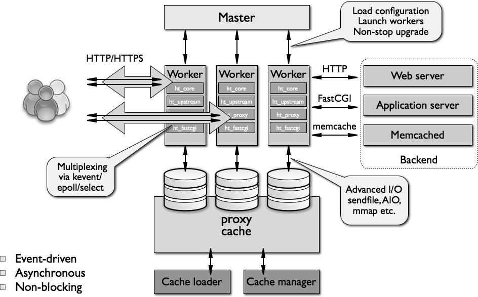

# **NGINX**

### **Table of Contents**

- [Introduction](#introduction)
- [Architecture](#Architecture)
- [Nginx for Frontend Apps](#nginx-for-frontend-apps)

<br>

## **Introduction**

Nginx is an open-source **web server software**. Usually used for:

- web server
- reverse proxy
- load balancing
- caching
- proxy server (IMAP, POP3, SMTP protocols)

<br>

## **Architecture**

Implements event-driven, asynchronous, and non-blocking models, NGINX uses master-slave architecture.

### **Master**

- **Role** - Manages the server, including reading configurations and spawning worker processes.

- **Characteristics**: Runs a single process that oversees the overall operation of NGINX.

### **Workers**

- **Role**

  Handle incoming client requests, perform data processing, and manage network connections.

- **Characteristics**:

  - **Single-Threaded** - Each worker process operates with a single thread.

  - **Independent** - Worker processes run independently and do not share memory space, except for specific shared resources like caches.

  - **Event-Driven and Non-Blocking**: Utilize an event-driven architecture to handle multiple connections concurrently without creating additional threads. This design allows each worker process to manage thousands of simultaneous connections efficiently.

### **Proxy caching**

Improves performance by storing and serving frequently accessed content efficiently. It relies on two key processes:

- **Cache Loader** - Scans cached files on disk and loads metadata into memory. Works in small batches to prevent performance bottlenecks. Configurable via proxy_cache_path (e.g., loader_threshold,loader_files).

- **Cache Manager** - Handles cache expiration and enforces size limits. Removes least recently used (LRU) items when cache exceeds max_size. Runs periodically to optimize storage and performance.

<br>


<br>
<br>

## **NGINX for Frontend Apps**

### **Why Use NGINX?**

- **Fast Static File Serving** – Serves HTML, CSS, JS, and images directly from disk.
- **Reverse Proxy for APIs** – Forwards requests to backend services, ensuring load balancing.
- **SSL/TLS Termination** – Manages HTTPS encryption efficiently.
- **Caching & Compression** – Uses **gzip** and **Brotli** for faster loading.
- **Security** – Protects backend services, mitigates DDoS attacks.

### **1. Containerized Frontend**

- Deploy as a **Docker container** with NGINX serving built frontend files.
- Typically used in **CI/CD pipelines** for automated deployments.
- Example `Dockerfile`:
  ```dockerfile
  FROM nginx:alpine
  COPY build/ /usr/share/nginx/html/
  CMD ["nginx", "-g", "daemon off;"]
  ```
- This setup allows frontend apps to be served in **isolated environments**, making them easier to scale and deploy.

### **2. Raw Code on Server**

- Upload static frontend files to a server manually or via automation tools (e.g., SCP, FTP, CI/CD pipelines).
- Configure NGINX to serve the frontend with **Single Page Application (SPA) routing**:

  ```nginx
  server {
      listen 80;
      root /var/www/frontend;
      index index.html;

      location / {
          try_files $uri /index.html;
      }
  }
  ```

- Ensures that all frontend routes redirect to `index.html`, allowing frameworks like React, Vue, and Angular to handle routing client-side.

### **Conclusion**

NGINX enhances frontend performance, scalability, and security, making it a preferred choice for modern web applications.
